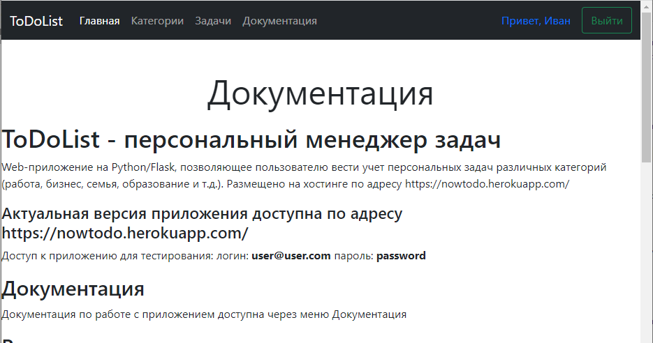
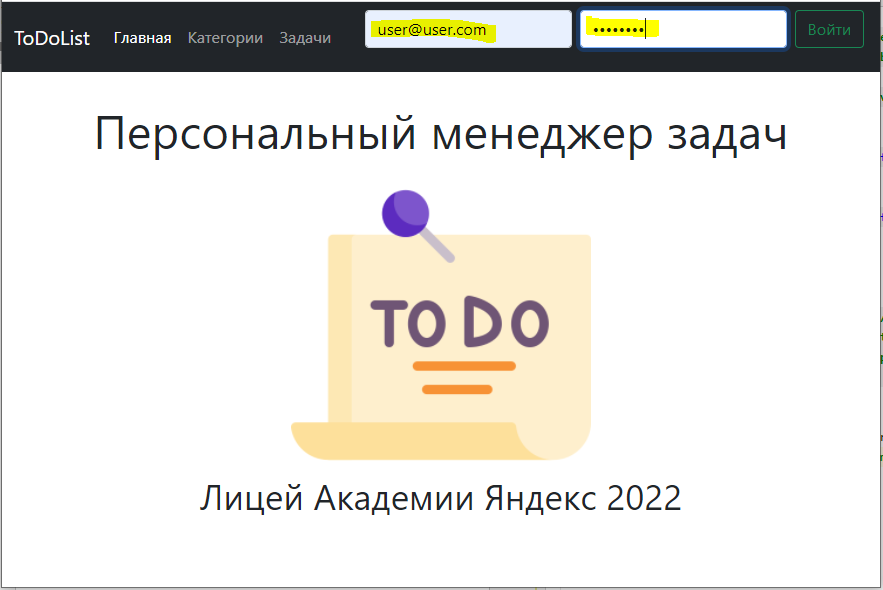
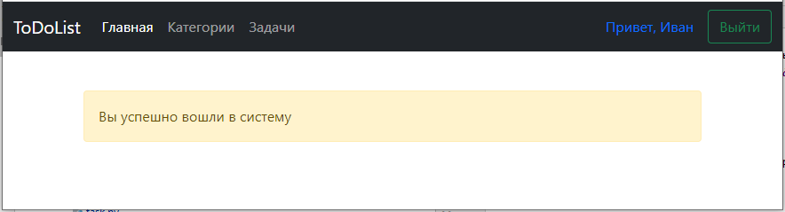
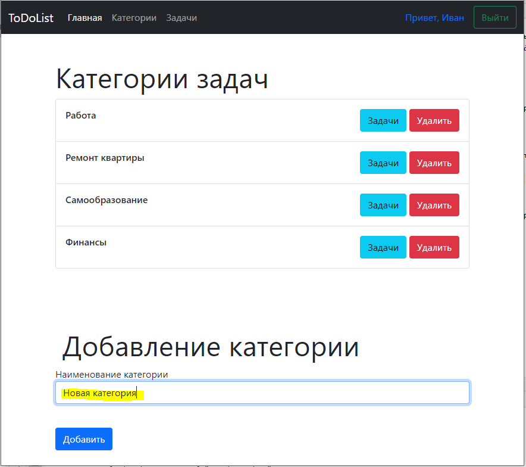
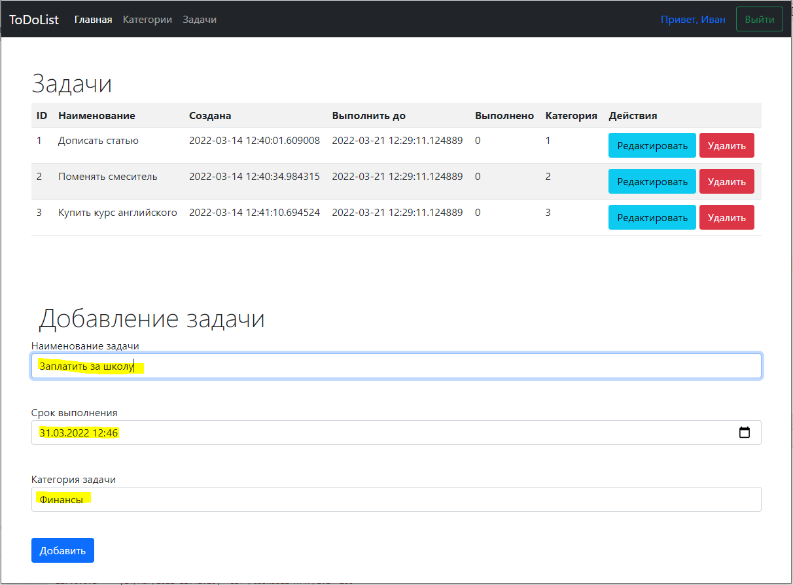

# ToDoList - персональный менеджер задач
Web-приложение на Python/Flask, позволяющее пользователю вести учет персональных задач различных категорий (работа, бизнес, семья, образование и т.д.). Размещено на хостинге по адресу https://nowtodo.herokuapp.com/
#### Актуальная версия приложения доступна по адресу https://nowtodo.herokuapp.com/
Доступ к приложению для тестирования:
логин: __user@user.com__
пароль: __password__
Для запуска на локальном компьютере запустите main.py и перейдите по адресу __http://127.0.0.1:8080/__
## Документация
Документация по работе с приложением доступна через меню Документация

## Вход в систему
Для вход в систему необходимо ввести логин и пароль (указаны выше)

В случае успешного входа в систему появится соответствующее сообщение

## Работа с категориями
Через меню Категории можно перейти на страницу с перечнем категорий. Доступны операции просмотра, создания и удаления категорий, а также переход к списку задач категории.

## Работа с задачами
Через меню Задачи можно перейти на страницу со списком задач. Доступны операции просмотра, создания, редактирования и удаления задач. При создании задачи указываетяс наименование, срок выполнения и категория (выбирается из выпадающего списка).

